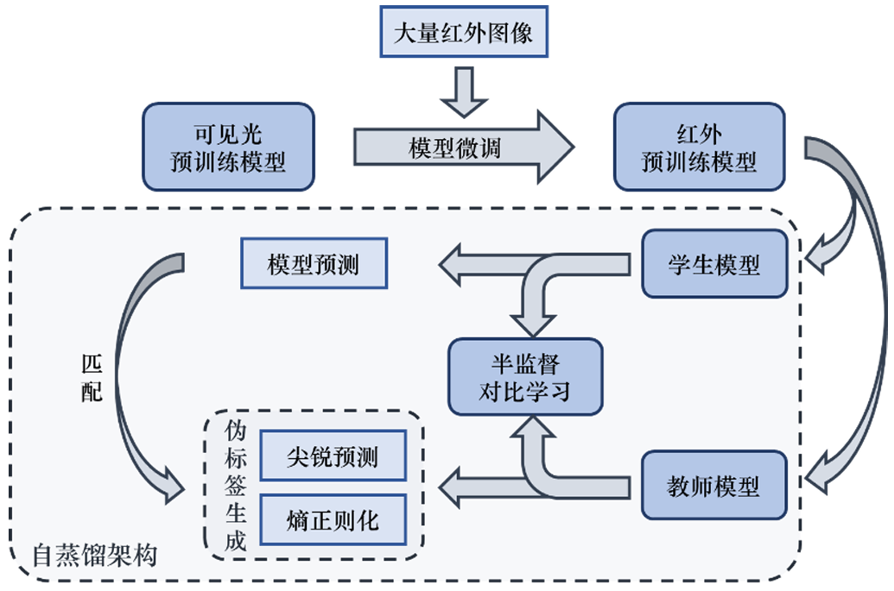
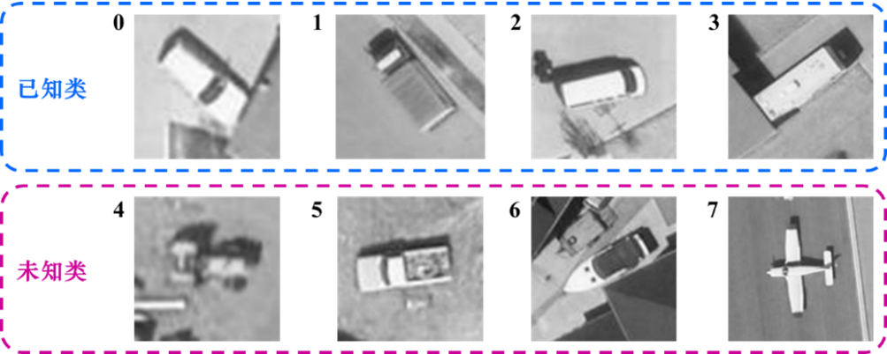
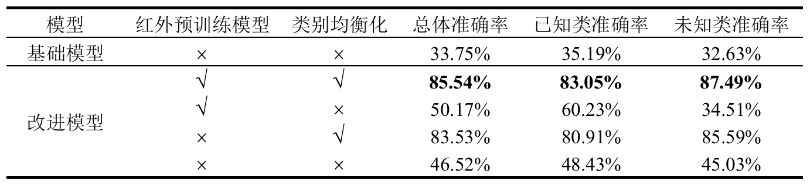

# 基于新类别发现的红外图像未知物体分类



新类别发现是一种解决传统识别模型在开放环境下不可行问题的学习范式，使模型在正确识别已知类别的基础上，具有正确发现并划分未知类别的能力。在红外图像上的新类别发现可以有效解决红外图像标注困难的问题。现有新类别发现方法在红外图像上难以学习到具有辨别性的表征，同时无法有效解决数据集类别不均衡的问题。针对这些问题，本文提出了基于自蒸馏和熵正则化的广义类别发现模型，模型使用在红外图像上的自监督预训练模型作为骨干网络，采用自蒸馏架构结合表征学习和参数分类提高对红外图像的特征提取能力，同时使用尖锐预测结合熵正则化获得优质伪标签提升分类性能。此外模型采用图像数量均衡化操作解决数据集图像不均衡问题。在VEDAI识别数据集上，本文所提出的模型相对其他现有模型总体分类准确度提升了40%以上。

## 运行

### 配置环境

```
pip install -r requirements.txt
```

### 数据集配置

在 ```config.py``` 文件下面设置数据集的路径。


### 数据集

研究选择VEDAI数据集作为测试数据集。VEDAI数据集是一个用于遥感图像中车辆检测的数据集，数据集包含成对可见光图像和红外图像。数据集中车辆除了体积小之外，还表现如车辆、光照（阴影）变化、镜面反射或遮挡等实际变化，具有一定的检测难度。
由于原始VEDAI数据为检测数据集，为了满足本文研究的需求，按照数据集所给的标注信息，将目标裁剪出来获得识别数据。由于仅按数据集给定的标注框裁剪得到识别包含较少背景信息，因此选择裁剪的长宽为标注框长宽的1.5倍以获得更多背景信息。同时，为了消除识别图像长宽不等对实验的影响，按照长边长度裁剪得到长宽相等的图像。此外，由于裁剪后的图像可能包含多个目标，制定数据集的过程中，将这些图像去除，最终去除图像数量过少的类别，得到八类目标数据，这也就是本研究使用的VEDAI红外识别数据集。数据集可通过百度网盘下载：https://pan.baidu.com/s/1me3TOt31bA8ULwDLZqqjHQ?pwd=5ib3 提取码: 5ib3。





### 训练模型

```
bash scripts/run_${DATASET_NAME}.sh
```
预训练模型可通过百度网盘下载：https://pan.baidu.com/s/1me3TOt31bA8ULwDLZqqjHQ?pwd=5ib3 提取码: 5ib3。

## Results

### 对比实验
VEDAI识别数据集上各模型性能对比

<table><thead><tr><th>模型</th> <th>总体准确率</th><th>已知类准确率</th><th>未知类准确率</th> </tr></thead>
<tbody>
		
<tr><td>GCD（基础模型）</td><td>33.75%	</td><td>35.19%</td><td>	32.63%</td></tr><tr>

<td>SimGCD</td><td>36.47%</td><td>48.66%</td><td>26.88%</td></tr><tr>
		
<td>DCCL</td><td>31.56%</td><td>34.01%</td><td>29.63%</td></tr><tr>

<td>ORCA</td><td>37.89%</td><td>57.37%</td><td>28.25%</td></tr><tr>

<td>改进模型</td><td>85.54%</td><td>83.05%</td><td>87.49%</td></tr><tr>

</tbody></table>

### 消融实验
改进模型各组件消融实验


## Acknowledgements

The codebase is largely built on this repo: https://github.com/sgvaze/generalized-category-discovery.
